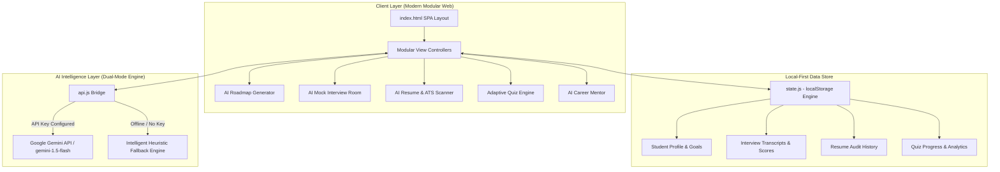

# WegUp 🚀
### AI-Powered Career Preparation & Engineering Placement Acceleration Platform

> **Academic Context**: 3rd-Year B.Tech / Engineering Mini-Project  
> **Institution**: BBD Educational Group (Babu Banarasi Das, Lucknow)  
> **Development Team**:
> - **Abhinav Tiwari** — *Project Lead & System Architect* ([@theabh12](https://github.com/theabh12))
> - **Adarsh Pandey** — *Core Contributor & AI Pipeline*
> - **Aditi Tiwari** — *Core Contributor & UI/UX Research*

---

## 📌 1. Project Abstract & Motivation

Modern engineering undergraduates face a severe preparation gap during campus placement cycles and off-campus recruitment:
1. **Fragmented Tooling**: Students bounce between disconnected platforms for syllabi, coding quizzes, resume formats, and mock interviews.
2. **Lack of Objective Feedback**: Self-studying candidates cannot gauge whether their project descriptions pass Applicant Tracking Systems (ATS) or if their interview answers follow industry-standard frameworks (such as the STAR methodology).
3. **Static, Non-Adaptive Roadmaps**: Generic syllabus PDFs ignore a student’s existing strengths, daily available study hours, and specific target company tiers (FAANG vs. Tech Startups vs. Placement Drives).

**WegUp** solves these challenges by combining **Google Gemini Generative AI** with a **Local-First, Zero-Latency Architecture**. It equips engineering students with an intelligent personal placement coach that dynamically adapts learning pathways, conducts conversational technical/HR mock interviews, evaluates resume ATS readiness, and tests core engineering competencies on demand.

---

## 🏛️ 2. System Architecture



---

## ✨ 3. Key Feature Pillars

### 🗺️ 1. Dynamic AI Roadmap & Study Planner
- Analyzes candidate role (Full Stack, Backend, AI/ML, DevOps, Cybersecurity, Mobile, etc.), starting level, existing skills, and target company tier.
- Synthesizes a structured 4-phase milestone roadmap (*Foundations*, *Specialization*, *Capstone Project*, and *Placement Drills*).
- Day-by-day task queue calculated dynamically from the student's daily study budget.

### 🎙️ 2. Interactive AI Mock Interviewer
- Conducts realistic multi-turn simulated interview rounds:
  - **Technical / Architecture**
  - **Behavioral & HR** (STAR Method: *Situation, Task, Action, Result*)
  - **System Design & APIs**
  - **CS Fundamentals** (DBMS, OS, Computer Networks)
- Generates an instant **Performance Scorecard** with:
  - Overall Placement Score (0–100)
  - Core Strengths & Missed Technical Keywords
  - Model Answer & Recruiter Pro-Tips.

### 📄 3. AI Resume & ATS Match Scanner
- Audits student resume text against target Job Descriptions.
- Computes an **ATS Match Score** with visual color-coded compliance.
- Highlights high-priority missing technical keywords.
- **STAR / Google XYZ Bullet Point Rewriter**: Automatically rewrites passive project descriptions (*"Worked on website"*) into quantified achievements (*"Engineered responsive full-stack platform using React & Node.js, reducing API latency by 35%"*).

### 🧠 4. Adaptive Technical Quiz Engine
- On-demand custom 4-question technical assessment generator across any chosen topic (Data Structures, SQL, React, Docker, Operating Systems).
- Instant interactive feedback detailing *why* the correct answer is right and why alternate choices fail.
- Stores historical score analytics to measure retention over time.

### ✦ 5. Context-Aware AI Career Mentor
- Conversational placement coach grounded in the student’s active goal, pending tasks, and target timeline.
- Includes one-click prompt templates for recruiter LinkedIn outreach, project pitch synthesis, and technical conflict explanation.

### 🛡️ 6. Zero-Failure Viva Guarantee (Dual-Mode Architecture)
- **Live AI Mode**: Directly connects to Google Gemini API via Google AI Studio API keys.
- **Intelligent Offline Mode**: Seamless local fallback ensures that if campus Wi-Fi drops during viva examination, the app executes smoothly without errors.

---

## 🛠️ 4. Technology Stack

| Layer | Technologies Used |
| :--- | :--- |
| **Frontend** | HTML5 Semantic Architecture, CSS3 Custom Properties (Design Tokens), Flexbox & Grid |
| **Logic & Modules** | ES6+ JavaScript Modules (`api.js`, `state.js`, `roadmap.js`, `interview.js`, `resume.js`, `quiz.js`, `coach.js`, `app.js`) |
| **Generative AI** | Google Gemini REST API (`gemini-1.5-flash`, `gemini-2.0-flash`) via Google AI Studio |
| **State & Persistence** | Browser `localStorage` sandbox with JSON backup import/export |
| **Design System** | Dark-theme ergonomics, accessible focus states, responsive mobile viewports |

---

## 🚀 5. Getting Started & Local Execution

WegUp requires **zero installation steps, build tools, or npm installations** to run.

### Option A: Direct Browser Launch
Simply double-click `index.html` or open it directly in Google Chrome, Microsoft Edge, or Mozilla Firefox:
```bash
# Windows
start index.html
```

### Option B: Local Live Server (Recommended)
You can run any lightweight local server (e.g. VS Code Live Server, Python, or Node):
```bash
# Using Python
python -m http.server 3000

# Open in browser:
http://localhost:3000
```

---

## 🔑 6. Configuring Google Gemini AI

1. Visit [Google AI Studio](https://aistudio.google.com/) and generate a free API Key.
2. In WegUp, click on **Settings & API** in the sidebar.
3. Paste your Gemini API key in the input box and click **"Test Live Connection ⚡"**.
4. Once verified, the status indicator will turn green: `Live AI (Gemini)`. All roadmaps, interviews, and resume audits will now be driven live by Google's state-of-the-art models.

---

## 🎓 7. Viva & Academic Presentation Guide

### Frequently Asked Questions by Examiners:
* **Q1: How is this different from generic chatbots like ChatGPT?**
  * *Answer*: WegUp is not an unconstrained chat window; it is a structured placement workflow engine. It grounds AI generations in student timeline data, implements role-specific scoring heuristics, automates the STAR interview rubric, and parses resume ATS compatibility.
* **Q2: What happens if there is no internet connection during evaluation?**
  * *Answer*: WegUp was built with a resilient dual-mode architecture. If an API key is absent or network fails, the platform seamlessly switches to local intelligent rule-based generation, ensuring 100% demo uptime.
* **Q3: Where is user data stored? Is student privacy protected?**
  * *Answer*: WegUp adheres to local-first privacy principles. All transcripts, scores, and resume drafts are stored strictly on the student's browser device via encrypted `localStorage`, with full JSON data export and reset capabilities.

---

## 📜 8. License & Attribution

Developed with passion by **Abhinav Tiwari**, **Adarsh Pandey**, and **Aditi Tiwari** for their 3rd-Year Engineering Mini-Project.  
Licensed under the [MIT License](LICENSE).
